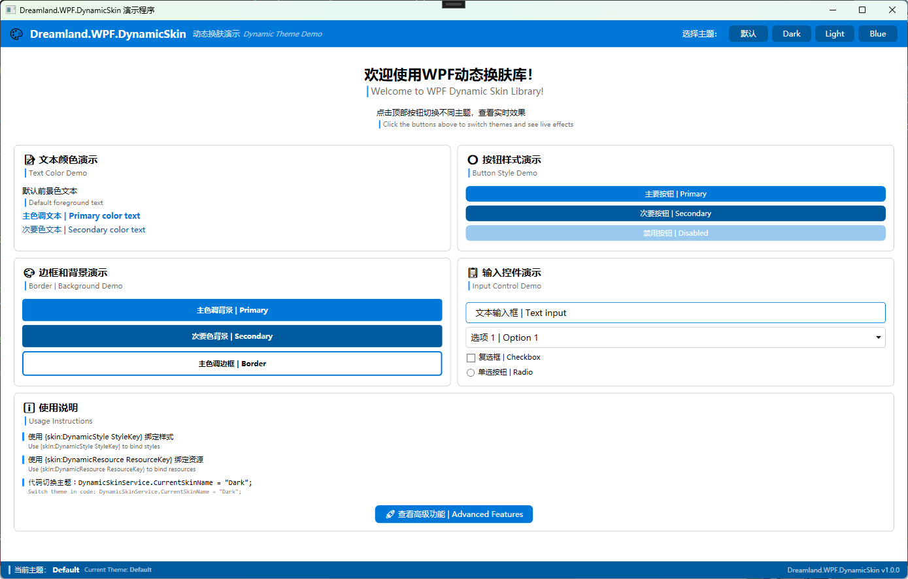

# Dreamland.WPF.DynamicSkin.Demo

这是 **Dreamland.WPF.DynamicSkin** 库的演示项目，展示了如何在 WPF 应用程序中实现动态主题切换功能。

## 📸 项目截图

### 默认主题


### 暗色主题 (Dark)


### 性能展示


## 🎯 项目简介

本演示项目展示了 `Dreamland.WPF.DynamicSkin` 库的核心功能，包括：

- ✨ **实时主题切换** - 无需重启应用即可切换主题
- 🎨 **多种预设主题** - 包括 Default、Dark、Light、Blue 等主题
- 🔧 **样式绑定演示** - 展示如何使用 `DynamicStyle` 和 `DynamicResource` 标记扩展
- 📦 **控件适配** - 演示各种 WPF 控件的主题适配效果
- 🚀 **高级功能** - 包括主题管理器、系统主题检测等

## 🏗️ 项目结构

```
Dreamland.WPF.DynamicSkin.Demo/
│
├── MainWindow.xaml              # 主窗口 - 展示基础主题切换功能
├── MainWindow.xaml.cs           # 主窗口逻辑
│
├── AdvancedWindow.xaml          # 高级功能窗口
├── AdvancedWindow.xaml.cs       # 高级功能逻辑
│
├── ThemeManager.cs              # 主题管理器 - 提供高级主题管理功能
│
├── Controls/                    # 自定义控件
│   ├── BilingualTextBlock.xaml  # 双语文本控件
│   └── BilingualTextBlock.xaml.cs
│
└── Images/                      # 项目截图
    ├── Default.png              # 默认主题截图
    ├── Darkness.png             # 暗色主题截图
    └── Performance.png          # 性能展示截图
```

## 🚀 快速开始

### 1. 运行项目

确保已安装 **.NET 8.0 SDK**，然后：

```bash
# 克隆仓库
git clone https://github.com/Firito/Dreamland.WPF.DynamicSkin.git

# 进入项目目录
cd Dreamland.WPF.DynamicSkin

# 运行演示项目
dotnet run --project Codes/Dreamland.WPF.DynamicSkin.Demo
```

或者直接在 Visual Studio 2022 中打开解决方案并运行。

### 2. 体验主题切换

运行应用后，您可以：

1. **点击顶部按钮** 切换不同主题（默认、Dark、Light、Blue）
2. **观察实时效果** - 所有控件颜色会立即更新
3. **查看高级功能** - 点击"查看高级功能"按钮打开高级功能窗口

## 📖 使用示例

### 在 XAML 中使用动态样式

```xaml
<!-- 引入命名空间 -->
xmlns:skin="clr-namespace:Dreamland.WPF.DynamicSkin;assembly=Dreamland.WPF.DynamicSkin"

<!-- 绑定样式 -->
<Button Content="主要按钮" 
        Style="{skin:DynamicStyle PrimaryButtonStyle}" />

<!-- 绑定资源 -->
<TextBlock Text="文本" 
           Foreground="{skin:DynamicResource ForegroundBrush}" />

<!-- Window 样式绑定 -->
<Window Style="{skin:DynamicStyle MainWindowStyle}">
    <!-- 内容 -->
</Window>
```

### 在代码中切换主题

```csharp
using Dreamland.WPF.DynamicSkin;

// 切换到 Dark 主题
DynamicSkinService.CurrentSkinName = "Dark";

// 切换到 Light 主题
DynamicSkinService.CurrentSkinName = "Light";

// 恢复默认主题
DynamicSkinService.CurrentSkinName = null;
```

### 使用主题管理器

```csharp
using Dreamland.WPF.DynamicSkin.Demo;

// 获取主题管理器实例
var themeManager = ThemeManager.Instance;

// 应用主题
themeManager.ApplyTheme("Dark");

// 循环切换主题
themeManager.NextTheme();

// 监听主题变更事件
themeManager.ThemeChanged += (sender, themeName) =>
{
    Debug.WriteLine($"主题已切换到: {themeName}");
};

// 根据系统主题自动切换
themeManager.ApplySystemTheme();

// 获取当前主题的主色调
Color primaryColor = themeManager.GetPrimaryColor();
```

## 🎨 功能展示

### 1. 主窗口功能

主窗口 (`MainWindow.xaml`) 展示了以下内容：

- **文本颜色演示** - 不同颜色级别的文本显示
- **按钮样式演示** - 主要按钮、次要按钮、禁用按钮
- **边框和背景演示** - 不同背景色和边框色的展示
- **输入控件演示** - TextBox、ComboBox、CheckBox、RadioButton 等
- **使用说明** - 如何在项目中使用动态换肤功能

### 2. 高级功能窗口

高级功能窗口 (`AdvancedWindow.xaml`) 提供：

- **主题管理器功能** - 高级主题切换和管理
- **系统主题检测** - 自动检测 Windows 系统主题
- **性能优化** - 主题预加载、缓存清理等
- **自定义控件** - 展示自定义控件的主题适配

### 3. 自定义控件

#### BilingualTextBlock 控件

一个支持中英文双语显示的文本控件：

```xaml
<controls:BilingualTextBlock 
    ChineseText="欢迎使用"
    EnglishText="Welcome"
    ChineseFontSize="16"
    EnglishFontSize="12"
    ShowTranslationIndicator="True" />
```

## 🔧 技术特点

### 1. 标记扩展

项目使用了两个核心标记扩展：

- **`DynamicStyle`** - 用于绑定动态样式，支持主题切换时自动更新
- **`DynamicResource`** - 用于绑定动态资源（颜色、画刷等）

### 2. 主题系统

- 主题以 **资源字典** 形式组织
- 支持 **继承和覆盖** 机制
- 提供 **默认回退** 值

### 3. 性能优化

- **资源缓存** - 避免重复加载资源
- **延迟加载** - 按需加载主题资源
- **主题预加载** - 提前加载常用主题

## 🎯 学习要点

通过本演示项目，您可以学习到：

1. **如何集成** Dreamland.WPF.DynamicSkin 库
2. **如何定义和使用** 动态样式和资源
3. **如何在运行时切换** 应用程序主题
4. **如何创建自定义控件** 并适配主题系统
5. **如何实现高级功能** 如系统主题检测、主题管理等

## 📦 依赖项

- **.NET 8.0** - 目标框架
- **Dreamland.WPF.DynamicSkin** - 核心换肤库
- **WPF** - Windows Presentation Foundation

## 🔗 相关链接

- **主项目**: [Dreamland.WPF.DynamicSkin](https://github.com/Firito/Dreamland.WPF.DynamicSkin)
- **NuGet 包**: [Dreamland.WPF.DynamicSkin](https://www.nuget.org/packages/Dreamland.WPF.DynamicSkin)

## 📝 开发说明

### 添加新主题

1. 在主库项目中创建新的主题资源字典
2. 在 `App.xaml` 中注册主题资源
3. 在演示项目中添加对应的切换按钮

### 扩展功能

- 可以基于 `ThemeManager` 类添加更多高级功能
- 可以创建自定义控件并适配主题系统
- 可以实现主题的持久化保存和加载

## ⚠️ 注意事项

1. 确保所有动态样式都已在主题资源字典中定义
2. 建议为所有动态资源提供默认回退值
3. 主题切换时某些控件可能需要手动刷新
4. 性能敏感场景建议使用主题预加载功能

## 📄 许可证

本演示项目遵循主项目的许可证协议。

---

**Enjoy dynamic theming in WPF! 🎨✨**
