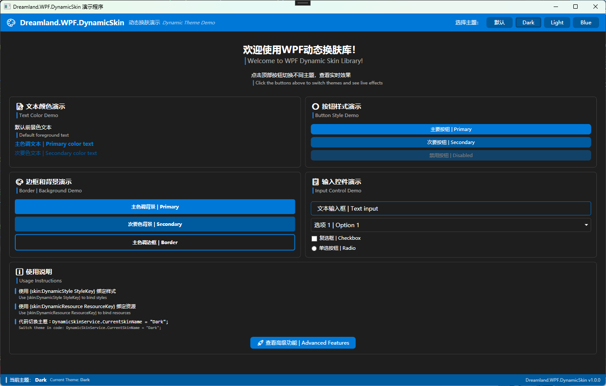

# Dreamland.WPF.DynamicSkin

[](https://www.nuget.org/packages/Dreamland.WPF.DynamicSkin)
[](LICENSE)

一个适用于 WPF 项目的**动态换肤控件库**，支持运行时无缝切换主题，无需重启应用程序。

**A dynamic skin-changing control library for WPF projects**, supporting seamless runtime theme switching without restarting the application.

---

## 📚 项目文档 Documentation

### 🎨 [Dreamland.WPF.DynamicSkin - 主库文档](Codes/Dreamland.WPF.DynamicSkin/README.md)

**核心动态换肤库** - 详细的 API 文档、使用指南和最佳实践

- ✨ 特性介绍和核心概念
- 📦 安装和快速开始
- 🔧 完整的 API 参考
- 📖 最佳实践和高级用法
- 🔍 故障排查指南

👉 **[查看完整文档](Codes/Dreamland.WPF.DynamicSkin/README.md)**

---

### 🚀 [Dreamland.WPF.DynamicSkin.Demo - 演示项目](Codes/Dreamland.WPF.DynamicSkin.Demo/README.md)

**功能演示和示例代码** - 展示如何在实际项目中使用动态换肤功能

- 📸 项目截图和效果展示
- 💡 使用示例和代码片段
- 🎯 功能展示和最佳实践
- 🔧 自定义控件示例

👉 **[查看演示文档](Codes/Dreamland.WPF.DynamicSkin.Demo/README.md)**

---

## 🎯 快速开始 Quick Start

### 安装 Installation

```bash
# NuGet Package Manager
Install-Package Dreamland.WPF.DynamicSkin

# .NET CLI
dotnet add package Dreamland.WPF.DynamicSkin
```

### 基础使用 Basic Usage

```xaml
<!-- 1. 引入命名空间 -->
<Window xmlns:skin="clr-namespace:Dreamland.WPF.DynamicSkin;assembly=Dreamland.WPF.DynamicSkin">
    
    <!-- 2. 使用动态样式 -->
    <Button Content="按钮" Style="{skin:DynamicStyle PrimaryButtonStyle}" />
    
    <!-- 3. 使用动态资源 -->
    <TextBlock Foreground="{skin:DynamicResource ForegroundBrush}" />
</Window>
```

```csharp
// 4. 在代码中切换主题
DynamicSkinService.CurrentSkinName = "Dark";
```

---

## ✨ 核心特性 Key Features

- 🎨 **运行时主题切换** - 无需重启应用即可动态更换主题
- 🚀 **高性能** - 基于资源缓存机制，主题切换流畅快速
- 🔌 **易于集成** - 仅需简单的 XAML 标记扩展即可使用
- 📦 **轻量级** - 零外部依赖，核心库体积小
- 🎯 **完全兼容** - 支持所有标准 WPF 控件和自定义控件
- 💡 **智能回退** - 主题资源未找到时自动回退到默认资源

---

## 📸 效果预览 Preview

### 默认主题


### 暗色主题 (Dark)


运行 Demo 项目查看完整效果展示，包括：

- ✅ 默认主题
- ✅ Dark 主题
- ✅ Light 主题  
- ✅ Blue 主题
- ✅ 实时主题切换演示

---

## 🚀 运行演示项目 Run Demo

```bash
# 克隆仓库
git clone https://github.com/Firito/Dreamland.WPF.DynamicSkin.git

# 进入目录
cd Dreamland.WPF.DynamicSkin

# 运行演示项目
dotnet run --project Codes/Dreamland.WPF.DynamicSkin.Demo
```

或直接在 Visual Studio 2022 中打开 `Dreamland.WPF.DynamicSkin.sln` 并运行。

---

## 📖 详细文档导航 Documentation Navigation

| 文档 | 内容 | 链接 |
|-----|------|------|
| 🎨 **主库文档** | API 参考、使用指南、最佳实践 | [查看文档](Codes/Dreamland.WPF.DynamicSkin/README.md) |
| 🚀 **演示项目** | 功能展示、示例代码、项目截图 | [查看文档](Codes/Dreamland.WPF.DynamicSkin.Demo/README.md) |

---

## 🤝 贡献 Contributing

欢迎贡献代码、报告问题或提出建议！

1. Fork 本仓库
2. 创建您的特性分支 (`git checkout -b feature/AmazingFeature`)
3. 提交您的更改 (`git commit -m 'Add some AmazingFeature'`)
4. 推送到分支 (`git push origin feature/AmazingFeature`)
5. 开启一个 Pull Request

---

## 📄 许可证 License

本项目采用 [MIT](LICENSE) 许可证。

---

## 🔗 相关链接 Links

- **GitHub**: [https://github.com/Firito/Dreamland.WPF.DynamicSkin](https://github.com/Firito/Dreamland.WPF.DynamicSkin)
- **NuGet**: [https://www.nuget.org/packages/Dreamland.WPF.DynamicSkin](https://www.nuget.org/packages/Dreamland.WPF.DynamicSkin)
- **Issues**: [https://github.com/Firito/Dreamland.WPF.DynamicSkin/issues](https://github.com/Firito/Dreamland.WPF.DynamicSkin/issues)

---

<div align="center">

**感谢使用 Dreamland.WPF.DynamicSkin! 🎨✨**

如果这个项目对您有帮助，请给它一个 ⭐

If you find this library helpful, please give it a ⭐ on GitHub!

</div>
